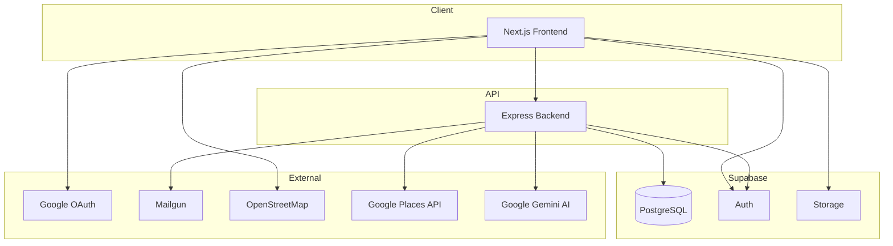

# ⛺ Camping Thailand

<div align="center">


**ค้นหาและจองแคมป์ไซต์ทั่วประเทศไทย**

[Features](#-features) • [Tech Stack](#-tech-stack) • [Getting Started](#-getting-started) • [Documentation](#-documentation)

</div>

---

## ✨ Features

<table>
<tr>
<td width="50%">

### 🔍 ค้นหาและกรอง
- ค้นหาตามจังหวัด/ชื่อแคมป์
- กรองตามประเภท ราคา amenities
- แผนที่แบบ Interactive
- เปรียบเทียบแคมป์ไซต์

</td>
<td width="50%">

### ⭐ รีวิวและให้คะแนน
- ระบบรีวิวแบบ Auto-approve
- อัพโหลดรูปภาพรีวิว
- โหวต Helpful
- Report รีวิวไม่เหมาะสม

</td>
</tr>
<tr>
<td width="50%">

### 👤 ระบบสมาชิก
- สมัคร/เข้าสู่ระบบ (Email, Google)
- 3 บทบาท: User, Owner, Admin
- Wishlist บันทึกแคมป์ที่ชอบ
- ส่งคำถามไปยังเจ้าของแคมป์

</td>
<td width="50%">

### 📊 Dashboard
- **Owner:** จัดการแคมป์ไซต์, ดู Analytics
- **Admin:** อนุมัติแคมป์, จัดการรีวิว
- แจ้งเตือนผ่าน Email

</td>
</tr>
</table>

---

## 🛠 Tech Stack

<div align="center">

| Frontend | Backend | Database | Infrastructure |
|:--------:|:-------:|:--------:|:--------------:|
|  |  |  |  |
|  |  |  |  |
|  |  |  |  |
|  |  |  |  |

</div>

---

## 📁 Project Structure

```
campsite/
├── 📂 apps/
│   ├── 🌐 campsite-frontend/     # Next.js 14+ (App Router)
│   │   ├── src/
│   │   │   ├── app/              # Pages & routes
│   │   │   ├── components/       # React components
│   │   │   ├── hooks/            # Custom hooks
│   │   │   └── lib/              # Utilities
│   │   └── public/               # Static assets
│   │
│   └── ⚙️ campsite-backend/      # Express + TypeScript
│       └── src/
│           ├── routes/           # API routes
│           ├── controllers/      # Route handlers
│           ├── services/         # Business logic
│           └── middleware/       # Auth, validation
│
├── 📦 packages/
│   ├── shared/                   # Types, Zod schemas
│   └── config/                   # ESLint, TypeScript configs
│
├── 🗄️ supabase/
│   ├── migrations/               # SQL migration files
│   └── seed.sql                  # Seed data
│
├── 📋 requirements/              # Project requirements
├── 📝 plans/                     # Development plans & todolists
├── turbo.json                    # Turborepo config
└── pnpm-workspace.yaml           # Workspace config
```

---

## 🚀 Getting Started

### Prerequisites

- **Node.js** >= 18.x
- **pnpm** >= 8.x
- **Supabase CLI** >= 1.x
- **Docker** (for local Supabase)

### Installation

```bash
# 1. Clone repository
git clone https://github.com/your-org/campsite.git
cd campsite

# 2. Install dependencies
pnpm install

# 3. Set up environment variables
cp apps/campsite-frontend/.env.example apps/campsite-frontend/.env.local
cp apps/campsite-backend/.env.example apps/campsite-backend/.env

# 4. Start Supabase locally
supabase start

# 5. Run migrations
pnpm db:migrate

# 6. Seed database (optional)
pnpm db:seed

# 7. Start development servers
pnpm dev
```

### Access Points

| Service | URL |
|---------|-----|
| Frontend | http://localhost:3000 |
| Backend API | http://localhost:4000 |
| Supabase Studio | http://localhost:54323 |

---

## 📜 Scripts

```bash
# Development
pnpm dev              # Start all dev servers
pnpm dev:frontend     # Start frontend only
pnpm dev:backend      # Start backend only

# Build
pnpm build            # Build all packages
pnpm build:frontend   # Build frontend
pnpm build:backend    # Build backend

# Testing
pnpm test             # Run all tests
pnpm test:unit        # Unit tests only
pnpm test:e2e         # E2E tests (Playwright)
pnpm test:coverage    # Test with coverage

# Database
pnpm db:migrate       # Apply migrations
pnpm db:reset         # Reset database
pnpm db:seed          # Seed test data
pnpm db:studio        # Open Supabase Studio

# Quality
pnpm lint             # Run ESLint
pnpm typecheck        # TypeScript check
pnpm format           # Format with Prettier
```

---

## 📖 Documentation

### Requirements
| Document | Description |
|----------|-------------|
| [PRD](./requirements/PRD-Camping.md) | Product Requirements |
| [SRS](./requirements/SRS-Camping.md) | Technical Specifications |
| [User Stories](./requirements/USER-STORIES-Camping.md) | 22 User Stories |
| [Database Schema](./requirements/DATABASE-SCHEMA.md) | 15 Tables, ERD |
| [Clarifications](./requirements/CLARIFICATIONS.md) | 18 Key Decisions |

### Development Plans
| Module | Plan | TodoList |
|--------|------|----------|
| 0. Project Setup | [Plan](./plans/0-project-setup-plan.md) | [Tasks](./plans/0-project-setup-todolist.md) |
| 1. Authentication | [Plan](./plans/1-authentication-plan.md) | [Tasks](./plans/1-authentication-todolist.md) |
| 2. Database & API | [Plan](./plans/2-database-api-plan.md) | [Tasks](./plans/2-database-api-todolist.md) |
| 3. Search & Discovery | [Plan](./plans/3-search-discovery-plan.md) | [Tasks](./plans/3-search-discovery-todolist.md) |
| 4. Campsite Detail | [Plan](./plans/4-campsite-detail-plan.md) | [Tasks](./plans/4-campsite-detail-todolist.md) |
| 5. Reviews System | [Plan](./plans/5-reviews-system-plan.md) | [Tasks](./plans/5-reviews-system-todolist.md) |
| 6. Maps & Location | [Plan](./plans/6-maps-location-plan.md) | [Tasks](./plans/6-maps-location-todolist.md) |
| 7. Wishlist & Compare | [Plan](./plans/7-wishlist-compare-plan.md) | [Tasks](./plans/7-wishlist-compare-todolist.md) |
| 8. Contact & Inquiry | [Plan](./plans/8-contact-inquiry-plan.md) | [Tasks](./plans/8-contact-inquiry-todolist.md) |
| 9. Owner Dashboard | [Plan](./plans/9-owner-dashboard-plan.md) | [Tasks](./plans/9-owner-dashboard-todolist.md) |
| 10. Admin Dashboard | [Plan](./plans/10-admin-dashboard-plan.md) | [Tasks](./plans/10-admin-dashboard-todolist.md) |
| 11. SEO & Performance | [Plan](./plans/11-seo-performance-plan.md) | [Tasks](./plans/11-seo-performance-todolist.md) |
| 12. Google Places API | [Plan](./plans/12-google-places-plan.md) | [Tasks](./plans/12-google-places-todolist.md) |

> 📌 **Master TodoList:** [plans/00-master-todolist.md](./plans/00-master-todolist.md)

---

## 🏗️ Architecture



---

## 🔐 Environment Variables

### Frontend (`.env.local`)
```env
NEXT_PUBLIC_SUPABASE_URL=your-supabase-url
NEXT_PUBLIC_SUPABASE_ANON_KEY=your-anon-key
NEXT_PUBLIC_API_URL=http://localhost:4000
```

### Backend (`.env`)
```env
SUPABASE_URL=your-supabase-url
SUPABASE_SERVICE_ROLE_KEY=your-service-key
MAILGUN_API_KEY=your-mailgun-key
MAILGUN_DOMAIN=your-domain
PORT=4000
NODE_ENV=development
```

---

## 🧪 Testing

```bash
# Run all tests
pnpm test

# Run with coverage
pnpm test:coverage

# Run E2E tests
pnpm test:e2e

# Run specific test file
pnpm test -- auth.test.ts
```

### Test Coverage Targets
- **Unit Tests:** 80%+
- **Integration Tests:** Critical paths
- **E2E Tests:** 100+ scenarios

---

## 🚢 Deployment

### Frontend (Vercel)
```bash
vercel deploy --prod
```

### Backend (Cloud Run)
```bash
gcloud run deploy campsite-api \
  --source . \
  --region asia-southeast1
```

### Database (Supabase)
```bash
supabase db push --project-ref your-project-ref
```

---

## 🤝 Contributing

1. Fork the repository
2. Create feature branch (`git checkout -b feature/amazing-feature`)
3. Commit changes (`git commit -m 'Add amazing feature'`)
4. Push to branch (`git push origin feature/amazing-feature`)
5. Open a Pull Request

---

## 📄 License

This project is licensed under the MIT License - see the [LICENSE](LICENSE) file for details.

---

<div align="center">

**Made with ❤️ for camping lovers in Thailand**

[⬆ Back to Top](#-camping-thailand)

</div>
