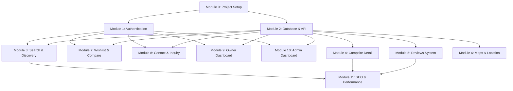

# Master TodoList - Camping Thailand Platform


---

## Executive Summary

This master todolist coordinates the implementation of all 12 modules for the Camping Thailand platform. Each module has a detailed todolist with comprehensive unit tests, integration tests, E2E tests, and smoke tests.

### Key Statistics
- **Estimated Total Tasks:** ~550+ tasks across all modules
- **Estimated Total Effort:** ~284 hours
- **Test Coverage Target:** 80%+
- **E2E Test Count:** 100+ tests
- **Tech Stack:** Next.js 14+, Express, Supabase, Tailwind + shadcn/ui

---

## Module Dependencies



---

## Plans & Todolists

| # | Module | Plan File | TodoList File | Status | Est. Effort | Priority |
|---|--------|-----------|---------------|--------|-------------|----------|
| 0 | Project Setup | 0-project-setup-plan.md | 0-project-setup-todolist.md | **completed** | ~14 hours | CRITICAL |
| 1 | Authentication | 1-authentication-plan.md | 1-authentication-todolist.md | **completed** | ~24 hours | CRITICAL |
| 2 | Database & API | 2-database-api-plan.md | 2-database-api-todolist.md | **completed** | ~25 hours | CRITICAL |
| 3 | Search & Discovery | 3-search-discovery-plan.md | 3-search-discovery-todolist.md | **completed** | ~26 hours | HIGH |
| 4 | Campsite Detail | 4-campsite-detail-plan.md | 4-campsite-detail-todolist.md | **completed** | ~29 hours | HIGH |
| 5 | Reviews System | 5-reviews-system-plan.md | 5-reviews-system-todolist.md | **completed** | ~26 hours | HIGH |
| 6 | Maps & Location | 6-maps-location-plan.md | 6-maps-location-todolist.md | **completed** | ~23 hours | MEDIUM |
| 7 | Wishlist & Compare | 7-wishlist-compare-plan.md | 7-wishlist-compare-todolist.md | **completed** | ~21 hours | MEDIUM |
| 8 | Contact & Inquiry | 8-contact-inquiry-plan.md | 8-contact-inquiry-todolist.md | **completed** | ~19 hours | HIGH |
| 9 | Owner Dashboard | 9-owner-dashboard-plan.md | 9-owner-dashboard-todolist.md | **completed** | ~32 hours | HIGH |
| 10 | Admin Dashboard | 10-admin-dashboard-plan.md | 10-admin-dashboard-todolist.md | **completed** | ~24 hours | HIGH |
| 11 | SEO & Performance | 11-seo-performance-plan.md | 11-seo-performance-todolist.md | **completed** | ~21 hours | MEDIUM |
| 12 | Google Places | 12-google-places-plan.md | 12-google-places-todolist.md | **completed** | ~30 hours | HIGH |

**Total Estimated Effort:** ~284 hours (~36 working days for 1 developer, ~18 days for 2 developers)

---

## Execution Order (Recommended)

### Phase 1: Foundation (Week 1-2)
Execute in strict order - critical dependencies:

1. [x] **Module 0: Project Setup** (2 days) ✅
   - `plans/0-project-setup-todolist.md`
   - Sets up Turborepo, Supabase, shadcn/ui
   - **Blocker for:** All other modules
   - **E2E Tests:** 4 smoke tests

2. [x] **Module 1: Authentication** (3 days) ✅
   - `plans/1-authentication-todolist.md`
   - Implements 3-role system, OAuth, owner registration
   - **Blocker for:** Modules 3, 7, 8, 9, 10
   - **E2E Tests:** 14 tests (signup, login, OAuth, owner request)

3. [x] **Module 2: Database & API** (3 days) ✅
   - `plans/2-database-api-todolist.md`
   - 22 migrations, Express API, middleware
   - **Blocker for:** Modules 3, 4, 5, 6, 7, 8, 9, 10
   - **E2E Tests:** 12 tests (migrations, API endpoints, RLS)

### Phase 2: Core Features (Week 3-4)
Can run partially in parallel after Phase 1:

4. [x] **Module 3: Search & Discovery** (3.5 days) ✅
   - `plans/3-search-discovery-todolist.md`
   - Province autocomplete, filters, search results
   - **Dependencies:** Modules 0, 1, 2
   - **E2E Tests:** 10 tests (search, filters, results)

5. [x] **Module 4: Campsite Detail** (3.5 days) ✅
   - `plans/4-campsite-detail-plan.md`
   - Detail page, gallery, accommodations
   - **Dependencies:** Modules 0, 2
   - **E2E Tests:** 12 tests (detail page, gallery, booking)

6. [x] **Module 5: Reviews System** (3.5 days) ✅
   - `plans/5-reviews-system-todolist.md`
   - Auto-approve reviews, report system, helpful voting
   - **Dependencies:** Modules 0, 2
   - **E2E Tests:** 11 tests (submit, report, vote, moderation)

### Phase 3: Enhanced Features (Week 5)
Can run in parallel:

7. [x] **Module 6: Maps & Location** (3 days) ✅
   - `plans/6-maps-location-todolist.md`
   - Leaflet integration, marker clustering
   - **Dependencies:** Modules 0, 2
   - **E2E Tests:** 8 tests (map, markers, popups, clustering)

8. [x] **Module 7: Wishlist & Compare** (2.5 days) ✅
   - `plans/7-wishlist-compare-todolist.md`
   - Wishlist CRUD, comparison table
   - **Dependencies:** Modules 0, 1, 2
   - **E2E Tests:** 9 tests (add, remove, compare)

9. [x] **Module 8: Contact & Inquiry** (2.5 days) ✅
   - `plans/8-contact-inquiry-todolist.md`
   - Inquiry form, rate limiting, email notifications
   - **Dependencies:** Modules 0, 1, 2
   - **E2E Tests:** 8 tests (submit, rate limit, emails)

### Phase 4: Dashboards (Week 6)
Owner dashboard can start earlier if needed:

10. [x] **Module 9: Owner Dashboard** (4 days) ✅
    - `plans/9-owner-dashboard-todolist.md`
    - Campsite management, analytics, inquiries
    - **Dependencies:** Modules 0, 1, 2
    - **E2E Tests:** 12 tests (CRUD, analytics, inquiries)

11. [x] **Module 10: Admin Dashboard** (3 days) ✅
    - `plans/10-admin-dashboard-todolist.md`
    - Campsite approval, owner requests, review moderation
    - **Dependencies:** Modules 0, 1, 2
    - **E2E Tests:** 10 tests (approvals, moderation)

### Phase 5: Optimization (Week 7)
Final polish and optimization:

12. [x] **Module 11: SEO & Performance** (2.5 days) ✅
    - `plans/11-seo-performance-todolist.md`
    - Meta tags, JSON-LD, sitemap, error pages, skeleton screens
    - **Dependencies:** Modules 0, 3, 4, 5
    - **E2E Tests:** 6 Lighthouse tests, 5 SEO tests

13. [x] **Module 12: Google Places** (4 days) ✅
    - `plans/12-google-places-plan.md`
    - Google Places API integration, AI processing, admin dashboard
    - **Dependencies:** Modules 0, 2, 10
    - **E2E Tests:** 8 sync, AI processing, admin dashboard tests

---

## Testing Strategy

### Overall Test Counts
- **Unit Tests:** ~220+ tests across all modules
- **Integration Tests:** ~45+ tests
- **E2E Tests:** ~100+ tests
- **Smoke Tests:** ~35+ tests
- **Performance Tests:** 6 Lighthouse audits

### Test Frameworks
- **Unit/Integration:** Jest + @testing-library/react + Supertest
- **E2E:** Playwright
- **Performance:** Lighthouse CI

### Coverage Targets
- **Overall:** 80%+
- **Critical Paths:** 90%+
- **UI Components:** 75%+
- **API Endpoints:** 85%+

---

## How to Execute

### Execute All Modules (Full Implementation)
```bash
# Execute modules in order (recommended for new project)
/rw-kit:execute plans/00-master-todolist.md
```

### Execute Specific Module
```bash
# Execute a single module
/rw-kit:execute plans/0-project-setup-todolist.md
/rw-kit:execute plans/1-authentication-todolist.md
# ... etc
```

### Execute by Phase
```bash
# Phase 1: Foundation
/rw-kit:execute plans/0-project-setup-todolist.md
/rw-kit:execute plans/1-authentication-todolist.md
/rw-kit:execute plans/2-database-api-todolist.md

# Phase 2: Core Features
/rw-kit:execute plans/3-search-discovery-todolist.md
/rw-kit:execute plans/4-campsite-detail-todolist.md
/rw-kit:execute plans/5-reviews-system-todolist.md

# Phase 3: Enhanced Features
/rw-kit:execute plans/6-maps-location-todolist.md
/rw-kit:execute plans/7-wishlist-compare-todolist.md
/rw-kit:execute plans/8-contact-inquiry-todolist.md

# Phase 4: Dashboards
/rw-kit:execute plans/9-owner-dashboard-todolist.md
/rw-kit:execute plans/10-admin-dashboard-todolist.md

# Phase 5: Optimization
/rw-kit:execute plans/11-seo-performance-todolist.md
```

---

## Key Features by Module

### Module 0: Project Setup
- Turborepo monorepo with pnpm workspaces
- Next.js 14+ frontend, Express backend
- Shared packages (types, Zod schemas)
- Supabase initialization
- shadcn/ui components

### Module 1: Authentication
- Email/password signup & login
- Google OAuth
- 3-role system (Admin, Owner, User)
- Owner registration flow
- RLS policies
- Password reset

### Module 2: Database & API
- 23 SQL migrations
- 15 database tables
- Express REST API
- Auth, validation, rate limiting middleware
- Seed data
- RLS policies

### Module 3: Search & Discovery
- Province autocomplete
- Multi-filter system (type, price, amenities, rating)
- Text search (Q7)
- Search results with pagination
- Featured campsites

### Module 4: Campsite Detail
- Hero section with gallery
- Supabase Storage Transform (Q3)
- Lightbox modal
- Accommodations pricing cards
- Amenities checklist
- Nearby attractions with Google Maps
- Skeleton loading (Q17)

### Module 5: Reviews System
- Auto-approve reviews (Q11)
- Report-based moderation
- Helpful voting
- Review submission with photos
- Rating aggregation trigger
- Admin moderation interface

### Module 6: Maps & Location
- Leaflet + OpenStreetMap
- Marker clustering
- Custom campsite markers
- Popup cards
- Nearby attractions with difficulty levels
- Google Maps directions

### Module 7: Wishlist & Compare
- Wishlist CRUD with optimistic updates
- Heart icon toggle
- Comparison table (2-3 campsites)
- Tab-based mobile view
- Local storage sync

### Module 8: Contact & Inquiry
- Inquiry form with validation
- Rate limiting (5/24h per user) (Q18)
- Mailgun email notifications (Q12)
- Owner inquiry management
- Reply system

### Module 9: Owner Dashboard
- Campsite CRUD
- Photo upload to Supabase Storage
- Analytics (views, inquiries)
- Inquiry management
- Approval status tracking

### Module 10: Admin Dashboard
- Campsite approval queue (Q8)
- Owner request approval (Q9)
- Review moderation (hide/unhide)
- Platform analytics
- User management

### Module 11: SEO & Performance
- Meta tags + OpenGraph
- JSON-LD schemas (Q15)
- Sitemap generation
- Custom error pages (Q16)
- Skeleton screens (Q17)
- Image optimization
- Lighthouse audits

---

## Clarifications Reference

All modules implement decisions from `requirements/CLARIFICATIONS.md`:

- **Q1:** 3 Roles (Admin, Owner, User)
- **Q2:** Basic featured flag (manual)
- **Q3:** Supabase Storage Transform for images
- **Q4:** Tailwind + shadcn/ui
- **Q5:** Supabase Migrations (not Prisma)
- **Q7:** Simple text match search
- **Q8:** Admin approval required for campsites
- **Q9:** Self-service Owner upgrade
- **Q10:** Multiple campsites per owner
- **Q11:** Auto-approve + report system for reviews
- **Q12:** Essential emails only (Mailgun)
- **Q13:** Core analytics metrics only
- **Q15:** Advanced SEO + AI Search (JSON-LD)
- **Q16:** Custom branded error pages
- **Q17:** Skeleton screens for loading
- **Q18:** Rate limiting only (5 inquiries/24h)

---

## Definition of Done (Overall Project)

### Code Complete
- [ ] All 12 modules implemented
- [ ] All ~550+ tasks completed
- [ ] All 220+ unit tests passing
- [ ] All 45+ integration tests passing
- [ ] All 100+ E2E tests passing
- [ ] All 35+ smoke tests passing
- [ ] Test coverage >= 80%

### Functionality
- [ ] Users can browse and search campsites
- [ ] Users can register, log in, manage profile
- [ ] Users can submit reviews, add to wishlist
- [ ] Users can send inquiries
- [ ] Owners can manage campsites
- [ ] Owners can view analytics
- [ ] Admins can approve campsites and owner requests
- [ ] Admins can moderate reviews

### Performance
- [ ] Lighthouse score >= 90
- [ ] First Contentful Paint < 1.5s
- [ ] Time to Interactive < 3.0s
- [ ] Page load < 2s on 3G

### Security
- [ ] All RLS policies enforced
- [ ] Authentication working
- [ ] Rate limiting active
- [ ] Input validation on all forms
- [ ] No SQL injection vulnerabilities
- [ ] No XSS vulnerabilities

### SEO
- [ ] Meta tags on all pages
- [ ] JSON-LD schemas implemented
- [ ] Sitemap generated
- [ ] Robots.txt configured
- [ ] Error pages customized

### Deployment
- [ ] Frontend deployed to Vercel
- [ ] Backend deployed to Cloud Run
- [ ] Supabase production instance configured
- [ ] Environment variables set
- [ ] DNS configured
- [ ] SSL certificates active

---

## Progress Summary

- **Total Modules:** 13
- **Completed:** 13 (Modules 0-12)
- **In Progress:** 0
- **Pending:** 0
- **Overall Progress:** 100% ✅

**Last Updated:** 2026-01-18

### Phase Completion
- **Phase 1 (Foundation):** ✅ Complete (Modules 0, 1, 2)
- **Phase 2 (Core Features):** ✅ Complete (Modules 3, 4, 5, 6)
- **Phase 3 (Enhanced Features):** ✅ Complete (Modules 7, 8, 9, 10)
- **Phase 4 (Optimization):** ✅ Complete (Module 11)
- **Phase 5 (Google Places):** ✅ Complete (Module 12)

---

## Notes

### Development Approach
1. Follow modules in order for dependencies
2. Complete all tests before moving to next module
3. Run E2E tests after each module
4. Deploy to staging after Phase 2
5. Full QA after Phase 4
6. Production deployment after Phase 5

### Team Recommendations
- **1 Full-stack Developer:** 7-8 weeks
- **2 Developers (Frontend + Backend):** 4-5 weeks
- **3 Developers (Frontend + Backend + QA):** 3-4 weeks

### Critical Path
Module 0 → Module 1 → Module 2 → (Parallel: 3, 4, 5, 6) → (Parallel: 7, 8, 9, 10) → Module 11

### Risk Mitigation
- Complete Phase 1 (Foundation) before starting others
- Run E2E tests continuously
- Deploy to staging early and often
- Monitor test coverage metrics
- Schedule code reviews after each phase
