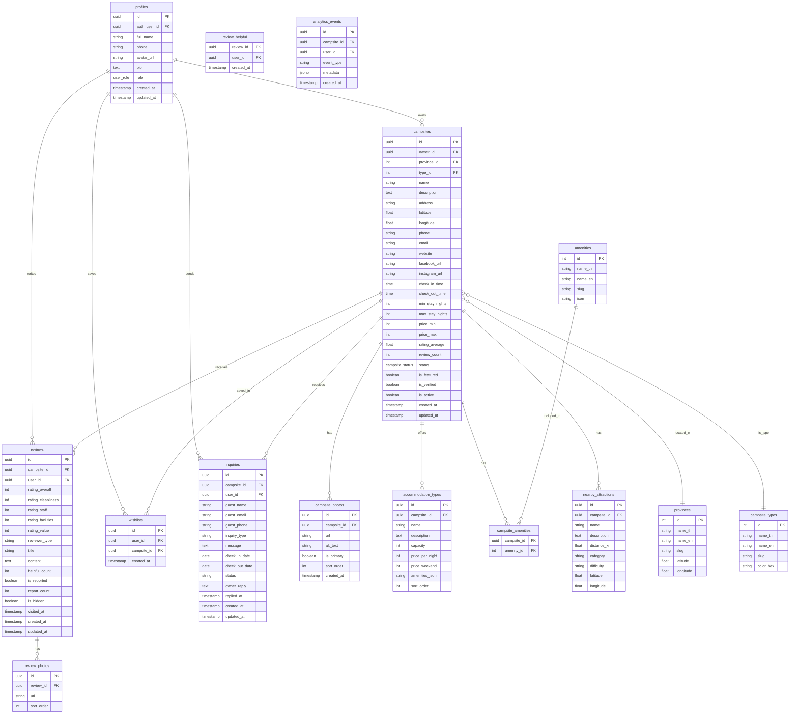

# Database Schema Design
## Camping Thailand Platform

**Document Version:** 1.1
**Last Updated:** January 17, 2026
**Database:** Supabase PostgreSQL
**Migrations:** Supabase CLI (supabase/migrations/)

---

## TABLE OF CONTENTS

1. [Overview](#overview)
2. [ERD Diagram](#erd-diagram)
3. [Tables](#tables)
4. [Indexes](#indexes)
5. [Row Level Security (RLS)](#row-level-security-rls)
6. [Seed Data](#seed-data)

---

## OVERVIEW

### Design Principles
- Use Supabase Auth for authentication (auth.users)
- Extend with `profiles` table for additional user data
- Use UUIDs for primary keys (Supabase default)
- Timestamps on all tables (created_at, updated_at)
- Soft delete where appropriate (deleted_at)
- Thai language support (UTF-8)

### Naming Conventions
- Tables: `snake_case`, plural (e.g., `campsites`, `reviews`)
- Columns: `snake_case` (e.g., `created_at`, `campsite_id`)
- Foreign keys: `{table_singular}_id` (e.g., `campsite_id`, `user_id`)
- Indexes: `idx_{table}_{column(s)}`
- Constraints: `{table}_{column}_{type}` (e.g., `reviews_rating_check`)

---

## ERD DIAGRAM



---

## TABLES

### 1. profiles
Extends Supabase auth.users with additional profile data.

```sql
-- Create user_role enum
CREATE TYPE user_role AS ENUM ('admin', 'owner', 'user');

CREATE TABLE profiles (
    id UUID PRIMARY KEY DEFAULT gen_random_uuid(),
    auth_user_id UUID UNIQUE REFERENCES auth.users(id) ON DELETE CASCADE,
    full_name VARCHAR(100) NOT NULL,
    phone VARCHAR(20),
    avatar_url TEXT,
    bio TEXT,
    role user_role DEFAULT 'user',
    created_at TIMESTAMPTZ DEFAULT NOW(),
    updated_at TIMESTAMPTZ DEFAULT NOW()
);

-- Index for role queries
CREATE INDEX idx_profiles_role ON profiles(role);

-- Trigger to create profile on auth.users insert
CREATE OR REPLACE FUNCTION handle_new_user()
RETURNS TRIGGER AS $$
BEGIN
    INSERT INTO public.profiles (auth_user_id, full_name, role)
    VALUES (NEW.id, COALESCE(NEW.raw_user_meta_data->>'full_name', 'User'), 'user');
    RETURN NEW;
END;
$$ LANGUAGE plpgsql SECURITY DEFINER;

CREATE TRIGGER on_auth_user_created
    AFTER INSERT ON auth.users
    FOR EACH ROW EXECUTE FUNCTION handle_new_user();
```

---

### 2. provinces
77 Thai provinces for location search.

```sql
CREATE TABLE provinces (
    id SERIAL PRIMARY KEY,
    name_th VARCHAR(100) NOT NULL,
    name_en VARCHAR(100) NOT NULL,
    slug VARCHAR(100) UNIQUE NOT NULL,
    latitude DECIMAL(10, 7) NOT NULL,
    longitude DECIMAL(10, 7) NOT NULL,
    region VARCHAR(50) -- north, south, central, east, northeast
);

CREATE INDEX idx_provinces_slug ON provinces(slug);
CREATE INDEX idx_provinces_name_th ON provinces(name_th);
CREATE INDEX idx_provinces_name_en ON provinces(name_en);
```

---

### 3. campsite_types
Lookup table for campsite types.

```sql
CREATE TABLE campsite_types (
    id SERIAL PRIMARY KEY,
    name_th VARCHAR(50) NOT NULL,
    name_en VARCHAR(50) NOT NULL,
    slug VARCHAR(50) UNIQUE NOT NULL,
    color_hex VARCHAR(7) NOT NULL -- for map markers
);

-- Seed data
INSERT INTO campsite_types (name_th, name_en, slug, color_hex) VALUES
('แคมป์ปิ้ง', 'Camping', 'camping', '#FF4444'),
('แกลมปิ้ง', 'Glamping', 'glamping', '#44FF44'),
('รีสอร์ทเต็นท์', 'Tented Resort', 'tented-resort', '#FF8844'),
('บังกะโล', 'Bungalow', 'bungalow', '#FFFF44');
```

---

### 4. amenities
Master list of amenities.

```sql
CREATE TABLE amenities (
    id SERIAL PRIMARY KEY,
    name_th VARCHAR(50) NOT NULL,
    name_en VARCHAR(50) NOT NULL,
    slug VARCHAR(50) UNIQUE NOT NULL,
    icon VARCHAR(50) NOT NULL -- icon name (e.g., 'wifi', 'snowflake')
);

-- Seed data
INSERT INTO amenities (name_th, name_en, slug, icon) VALUES
('WiFi', 'WiFi', 'wifi', 'wifi'),
('ไฟฟ้า', 'Electricity', 'electricity', 'zap'),
('แอร์', 'Air Conditioning', 'ac', 'snowflake'),
('น้ำอุ่น', 'Hot Water', 'hot-water', 'droplet'),
('ห้องน้ำส่วนตัว', 'Private Bathroom', 'private-bathroom', 'bath'),
('ร้านอาหาร', 'Restaurant', 'restaurant', 'utensils'),
('ห้องครัว', 'Kitchen', 'kitchen', 'chef-hat'),
('ที่จอดรถ', 'Parking', 'parking', 'car');
```

---

### 5. campsites
Main campsite listings.

```sql
-- Create campsite_status enum
CREATE TYPE campsite_status AS ENUM ('pending', 'approved', 'rejected');

CREATE TABLE campsites (
    id UUID PRIMARY KEY DEFAULT gen_random_uuid(),
    owner_id UUID REFERENCES profiles(id) ON DELETE SET NULL,
    province_id INT NOT NULL REFERENCES provinces(id),
    type_id INT NOT NULL REFERENCES campsite_types(id),

    -- Basic Info
    name VARCHAR(200) NOT NULL,
    description TEXT,

    -- Location
    address TEXT NOT NULL,
    latitude DECIMAL(10, 7) NOT NULL,
    longitude DECIMAL(10, 7) NOT NULL,

    -- Contact
    phone VARCHAR(20),
    email VARCHAR(255),
    website TEXT,
    facebook_url TEXT,
    instagram_url TEXT,
    booking_url TEXT, -- external booking link

    -- Policies
    check_in_time TIME DEFAULT '14:00',
    check_out_time TIME DEFAULT '12:00',
    min_stay_nights INT DEFAULT 1,
    max_stay_nights INT,

    -- Pricing (for filtering)
    price_min INT NOT NULL DEFAULT 0,
    price_max INT NOT NULL DEFAULT 0,

    -- Computed/Cached
    rating_average DECIMAL(2, 1) DEFAULT 0,
    review_count INT DEFAULT 0,

    -- Status & Approval
    status campsite_status DEFAULT 'pending',
    is_featured BOOLEAN DEFAULT FALSE,
    is_verified BOOLEAN DEFAULT FALSE,
    is_active BOOLEAN DEFAULT TRUE,

    -- Timestamps
    created_at TIMESTAMPTZ DEFAULT NOW(),
    updated_at TIMESTAMPTZ DEFAULT NOW()
);

-- Indexes for search performance
CREATE INDEX idx_campsites_province ON campsites(province_id);
CREATE INDEX idx_campsites_type ON campsites(type_id);
CREATE INDEX idx_campsites_price ON campsites(price_min, price_max);
CREATE INDEX idx_campsites_rating ON campsites(rating_average DESC);
CREATE INDEX idx_campsites_status ON campsites(status);
CREATE INDEX idx_campsites_featured ON campsites(is_featured) WHERE is_featured = TRUE;
CREATE INDEX idx_campsites_approved ON campsites(status) WHERE status = 'approved';
CREATE INDEX idx_campsites_active ON campsites(is_active) WHERE is_active = TRUE;
CREATE INDEX idx_campsites_location ON campsites USING GIST (
    ll_to_earth(latitude, longitude)
);
CREATE INDEX idx_campsites_name_search ON campsites USING GIN (
    to_tsvector('thai', name || ' ' || COALESCE(description, ''))
);
```

---

### 6. campsite_amenities
Junction table for campsite-amenity relationship.

```sql
CREATE TABLE campsite_amenities (
    campsite_id UUID REFERENCES campsites(id) ON DELETE CASCADE,
    amenity_id INT REFERENCES amenities(id) ON DELETE CASCADE,
    PRIMARY KEY (campsite_id, amenity_id)
);

CREATE INDEX idx_campsite_amenities_campsite ON campsite_amenities(campsite_id);
CREATE INDEX idx_campsite_amenities_amenity ON campsite_amenities(amenity_id);
```

---

### 7. accommodation_types
Different accommodation options within a campsite.

```sql
CREATE TABLE accommodation_types (
    id UUID PRIMARY KEY DEFAULT gen_random_uuid(),
    campsite_id UUID NOT NULL REFERENCES campsites(id) ON DELETE CASCADE,
    name VARCHAR(100) NOT NULL,
    description TEXT,
    capacity INT NOT NULL DEFAULT 2,
    price_per_night INT NOT NULL,
    price_weekend INT, -- optional weekend price
    amenities_included TEXT[], -- array of amenity slugs
    sort_order INT DEFAULT 0,
    is_active BOOLEAN DEFAULT TRUE,
    created_at TIMESTAMPTZ DEFAULT NOW(),
    updated_at TIMESTAMPTZ DEFAULT NOW()
);

CREATE INDEX idx_accommodation_types_campsite ON accommodation_types(campsite_id);
```

---

### 8. campsite_photos
Photo gallery for campsites.

```sql
CREATE TABLE campsite_photos (
    id UUID PRIMARY KEY DEFAULT gen_random_uuid(),
    campsite_id UUID NOT NULL REFERENCES campsites(id) ON DELETE CASCADE,
    url TEXT NOT NULL,
    alt_text VARCHAR(255),
    is_primary BOOLEAN DEFAULT FALSE,
    sort_order INT DEFAULT 0,
    created_at TIMESTAMPTZ DEFAULT NOW()
);

CREATE INDEX idx_campsite_photos_campsite ON campsite_photos(campsite_id);
```

---

### 9. reviews
User reviews for campsites. Reviews are auto-approved and use a report system for moderation.

```sql
CREATE TYPE reviewer_type AS ENUM ('family', 'couple', 'solo', 'group');

CREATE TABLE reviews (
    id UUID PRIMARY KEY DEFAULT gen_random_uuid(),
    campsite_id UUID NOT NULL REFERENCES campsites(id) ON DELETE CASCADE,
    user_id UUID NOT NULL REFERENCES profiles(id) ON DELETE CASCADE,

    -- Ratings (1-5)
    rating_overall INT NOT NULL CHECK (rating_overall BETWEEN 1 AND 5),
    rating_cleanliness INT CHECK (rating_cleanliness BETWEEN 1 AND 5),
    rating_staff INT CHECK (rating_staff BETWEEN 1 AND 5),
    rating_facilities INT CHECK (rating_facilities BETWEEN 1 AND 5),
    rating_value INT CHECK (rating_value BETWEEN 1 AND 5),

    -- Content
    reviewer_type reviewer_type NOT NULL,
    title VARCHAR(100),
    content TEXT NOT NULL CHECK (char_length(content) BETWEEN 20 AND 500),

    -- Engagement
    helpful_count INT DEFAULT 0,

    -- Report-based Moderation (auto-approve, report to remove)
    is_reported BOOLEAN DEFAULT FALSE,
    report_count INT DEFAULT 0,
    is_hidden BOOLEAN DEFAULT FALSE,

    -- Dates
    visited_at DATE,
    created_at TIMESTAMPTZ DEFAULT NOW(),
    updated_at TIMESTAMPTZ DEFAULT NOW(),

    -- Prevent duplicate reviews
    UNIQUE (campsite_id, user_id)
);

CREATE INDEX idx_reviews_campsite ON reviews(campsite_id);
CREATE INDEX idx_reviews_user ON reviews(user_id);
CREATE INDEX idx_reviews_reported ON reviews(is_reported) WHERE is_reported = TRUE;
CREATE INDEX idx_reviews_hidden ON reviews(is_hidden) WHERE is_hidden = FALSE;
CREATE INDEX idx_reviews_created ON reviews(created_at DESC);
```

---

### 10. review_photos
Photos attached to reviews.

```sql
CREATE TABLE review_photos (
    id UUID PRIMARY KEY DEFAULT gen_random_uuid(),
    review_id UUID NOT NULL REFERENCES reviews(id) ON DELETE CASCADE,
    url TEXT NOT NULL,
    sort_order INT DEFAULT 0
);

CREATE INDEX idx_review_photos_review ON review_photos(review_id);
```

---

### 11. review_helpful
Track helpful votes (one per user per review).

```sql
CREATE TABLE review_helpful (
    review_id UUID REFERENCES reviews(id) ON DELETE CASCADE,
    user_id UUID REFERENCES profiles(id) ON DELETE CASCADE,
    created_at TIMESTAMPTZ DEFAULT NOW(),
    PRIMARY KEY (review_id, user_id)
);
```

---

### 12. wishlists
User saved campsites.

```sql
CREATE TABLE wishlists (
    id UUID PRIMARY KEY DEFAULT gen_random_uuid(),
    user_id UUID NOT NULL REFERENCES profiles(id) ON DELETE CASCADE,
    campsite_id UUID NOT NULL REFERENCES campsites(id) ON DELETE CASCADE,
    created_at TIMESTAMPTZ DEFAULT NOW(),
    UNIQUE (user_id, campsite_id)
);

CREATE INDEX idx_wishlists_user ON wishlists(user_id);
CREATE INDEX idx_wishlists_campsite ON wishlists(campsite_id);
```

---

### 13. inquiries
Contact inquiries from travelers to campsite owners.

```sql
CREATE TYPE inquiry_type AS ENUM ('booking', 'general', 'complaint', 'other');
CREATE TYPE inquiry_status AS ENUM ('new', 'in_progress', 'resolved', 'closed');

CREATE TABLE inquiries (
    id UUID PRIMARY KEY DEFAULT gen_random_uuid(),
    campsite_id UUID NOT NULL REFERENCES campsites(id) ON DELETE CASCADE,
    user_id UUID REFERENCES profiles(id) ON DELETE SET NULL,

    -- Guest info (in case not logged in)
    guest_name VARCHAR(100) NOT NULL,
    guest_email VARCHAR(255) NOT NULL,
    guest_phone VARCHAR(20),

    -- Inquiry details
    inquiry_type inquiry_type NOT NULL DEFAULT 'general',
    message TEXT NOT NULL CHECK (char_length(message) BETWEEN 20 AND 2000),
    check_in_date DATE,
    check_out_date DATE,

    -- Response
    status inquiry_status DEFAULT 'new',
    owner_reply TEXT,
    replied_at TIMESTAMPTZ,

    -- Timestamps
    created_at TIMESTAMPTZ DEFAULT NOW(),
    updated_at TIMESTAMPTZ DEFAULT NOW()
);

CREATE INDEX idx_inquiries_campsite ON inquiries(campsite_id);
CREATE INDEX idx_inquiries_user ON inquiries(user_id);
CREATE INDEX idx_inquiries_status ON inquiries(status);
CREATE INDEX idx_inquiries_created ON inquiries(created_at DESC);
```

---

### 14. nearby_attractions
Points of interest near campsites.

```sql
CREATE TYPE attraction_category AS ENUM ('hiking', 'waterfall', 'temple', 'viewpoint', 'lake', 'cave', 'market', 'other');
CREATE TYPE difficulty_level AS ENUM ('easy', 'moderate', 'hard');

CREATE TABLE nearby_attractions (
    id UUID PRIMARY KEY DEFAULT gen_random_uuid(),
    campsite_id UUID NOT NULL REFERENCES campsites(id) ON DELETE CASCADE,
    name VARCHAR(200) NOT NULL,
    description TEXT,
    distance_km DECIMAL(5, 1) NOT NULL,
    category attraction_category NOT NULL,
    difficulty difficulty_level,
    latitude DECIMAL(10, 7),
    longitude DECIMAL(10, 7),
    created_at TIMESTAMPTZ DEFAULT NOW()
);

CREATE INDEX idx_nearby_attractions_campsite ON nearby_attractions(campsite_id);
```

---

### 15. analytics_events
Track user interactions for analytics dashboard.

```sql
CREATE TYPE event_type AS ENUM (
    'search_impression',
    'profile_view',
    'booking_click',
    'inquiry_sent',
    'wishlist_add',
    'phone_click',
    'website_click'
);

CREATE TABLE analytics_events (
    id UUID PRIMARY KEY DEFAULT gen_random_uuid(),
    campsite_id UUID REFERENCES campsites(id) ON DELETE CASCADE,
    user_id UUID REFERENCES profiles(id) ON DELETE SET NULL,
    event_type event_type NOT NULL,
    metadata JSONB DEFAULT '{}',
    created_at TIMESTAMPTZ DEFAULT NOW()
);

CREATE INDEX idx_analytics_campsite ON analytics_events(campsite_id);
CREATE INDEX idx_analytics_type ON analytics_events(event_type);
CREATE INDEX idx_analytics_created ON analytics_events(created_at DESC);

-- Partitioning for large-scale analytics (optional)
-- CREATE TABLE analytics_events ... PARTITION BY RANGE (created_at);
```

---

## INDEXES

### Summary of Performance Indexes

| Table | Index | Purpose |
|-------|-------|---------|
| campsites | idx_campsites_province | Filter by province |
| campsites | idx_campsites_type | Filter by type |
| campsites | idx_campsites_price | Filter by price range |
| campsites | idx_campsites_rating | Sort by rating |
| campsites | idx_campsites_location | Geo queries |
| campsites | idx_campsites_name_search | Full-text search |
| reviews | idx_reviews_campsite | Get reviews for campsite |
| reviews | idx_reviews_created | Sort by newest |
| wishlists | idx_wishlists_user | Get user's wishlist |
| inquiries | idx_inquiries_campsite | Owner's inquiries |
| analytics_events | idx_analytics_created | Time-based queries |

---

## ROW LEVEL SECURITY (RLS)

### Enable RLS on all tables

```sql
-- Enable RLS
ALTER TABLE profiles ENABLE ROW LEVEL SECURITY;
ALTER TABLE campsites ENABLE ROW LEVEL SECURITY;
ALTER TABLE reviews ENABLE ROW LEVEL SECURITY;
ALTER TABLE wishlists ENABLE ROW LEVEL SECURITY;
ALTER TABLE inquiries ENABLE ROW LEVEL SECURITY;
ALTER TABLE campsite_photos ENABLE ROW LEVEL SECURITY;
ALTER TABLE accommodation_types ENABLE ROW LEVEL SECURITY;
ALTER TABLE review_photos ENABLE ROW LEVEL SECURITY;
ALTER TABLE nearby_attractions ENABLE ROW LEVEL SECURITY;
ALTER TABLE analytics_events ENABLE ROW LEVEL SECURITY;

-- Public read tables (no RLS needed for read)
-- provinces, campsite_types, amenities, campsite_amenities
```

### RLS Policies

```sql
-- PROFILES
-- Users can read all profiles
CREATE POLICY "Profiles are viewable by everyone"
    ON profiles FOR SELECT USING (true);

-- Users can update own profile
CREATE POLICY "Users can update own profile"
    ON profiles FOR UPDATE USING (
        auth.uid() = auth_user_id
    );

-- CAMPSITES
-- Anyone can view active campsites
CREATE POLICY "Active campsites are viewable by everyone"
    ON campsites FOR SELECT USING (is_active = true);

-- Owners can update their own campsites
CREATE POLICY "Owners can update own campsites"
    ON campsites FOR UPDATE USING (
        owner_id = (SELECT id FROM profiles WHERE auth_user_id = auth.uid())
    );

-- Owners can insert campsites
CREATE POLICY "Owners can insert campsites"
    ON campsites FOR INSERT WITH CHECK (
        owner_id = (SELECT id FROM profiles WHERE auth_user_id = auth.uid())
    );

-- REVIEWS
-- Anyone can view approved reviews
CREATE POLICY "Approved reviews are viewable by everyone"
    ON reviews FOR SELECT USING (status = 'approved');

-- Authenticated users can insert reviews
CREATE POLICY "Authenticated users can insert reviews"
    ON reviews FOR INSERT WITH CHECK (
        user_id = (SELECT id FROM profiles WHERE auth_user_id = auth.uid())
    );

-- Users can update own reviews
CREATE POLICY "Users can update own reviews"
    ON reviews FOR UPDATE USING (
        user_id = (SELECT id FROM profiles WHERE auth_user_id = auth.uid())
    );

-- WISHLISTS
-- Users can only see own wishlist
CREATE POLICY "Users can view own wishlist"
    ON wishlists FOR SELECT USING (
        user_id = (SELECT id FROM profiles WHERE auth_user_id = auth.uid())
    );

-- Users can manage own wishlist
CREATE POLICY "Users can manage own wishlist"
    ON wishlists FOR ALL USING (
        user_id = (SELECT id FROM profiles WHERE auth_user_id = auth.uid())
    );

-- INQUIRIES
-- Users can view own inquiries
CREATE POLICY "Users can view own inquiries"
    ON inquiries FOR SELECT USING (
        user_id = (SELECT id FROM profiles WHERE auth_user_id = auth.uid())
        OR
        campsite_id IN (
            SELECT id FROM campsites
            WHERE owner_id = (SELECT id FROM profiles WHERE auth_user_id = auth.uid())
        )
    );

-- Anyone can insert inquiries
CREATE POLICY "Anyone can send inquiries"
    ON inquiries FOR INSERT WITH CHECK (true);

-- Owners can update inquiries for their campsites
CREATE POLICY "Owners can update inquiries"
    ON inquiries FOR UPDATE USING (
        campsite_id IN (
            SELECT id FROM campsites
            WHERE owner_id = (SELECT id FROM profiles WHERE auth_user_id = auth.uid())
        )
    );
```

---

## SEED DATA

### Provinces (sample)
```sql
INSERT INTO provinces (name_th, name_en, slug, latitude, longitude, region) VALUES
('กรุงเทพมหานคร', 'Bangkok', 'bangkok', 13.7563, 100.5018, 'central'),
('เชียงใหม่', 'Chiang Mai', 'chiang-mai', 18.7883, 98.9853, 'north'),
('เชียงราย', 'Chiang Rai', 'chiang-rai', 19.9105, 99.8406, 'north'),
('นครราชสีมา', 'Nakhon Ratchasima', 'nakhon-ratchasima', 14.9799, 102.0978, 'northeast'),
('สุราษฎร์ธานี', 'Surat Thani', 'surat-thani', 9.1382, 99.3217, 'south'),
('ภูเก็ต', 'Phuket', 'phuket', 7.8804, 98.3923, 'south'),
('กาญจนบุรี', 'Kanchanaburi', 'kanchanaburi', 14.0227, 99.5328, 'central'),
('ประจวบคีรีขันธ์', 'Prachuap Khiri Khan', 'prachuap-khiri-khan', 11.8126, 99.7957, 'central');
-- ... (all 77 provinces)
```

### Sample Campsite
```sql
INSERT INTO campsites (
    owner_id, province_id, type_id, name, description, address,
    latitude, longitude, phone, email, website,
    check_in_time, check_out_time, price_min, price_max
) VALUES (
    'owner-uuid-here',
    2, -- Chiang Mai
    2, -- Glamping
    'Mountain View Glamping',
    'สัมผัสธรรมชาติท่ามกลางขุนเขา พร้อมสิ่งอำนวยความสะดวกครบครัน',
    '123 หมู่ 4 ต.แม่แรม อ.แม่ริม จ.เชียงใหม่',
    18.9088, 98.8644,
    '081-234-5678',
    'contact@mountainviewglamping.com',
    'https://mountainviewglamping.com',
    '14:00', '12:00',
    1500, 4500
);
```

---

## FUNCTIONS & TRIGGERS

### Update rating on new review

```sql
-- Reviews are auto-approved, filter out hidden reviews from rating calculation
CREATE OR REPLACE FUNCTION update_campsite_rating()
RETURNS TRIGGER AS $$
BEGIN
    UPDATE campsites SET
        rating_average = (
            SELECT ROUND(AVG(rating_overall)::numeric, 1)
            FROM reviews
            WHERE campsite_id = NEW.campsite_id AND is_hidden = FALSE
        ),
        review_count = (
            SELECT COUNT(*)
            FROM reviews
            WHERE campsite_id = NEW.campsite_id AND is_hidden = FALSE
        ),
        updated_at = NOW()
    WHERE id = NEW.campsite_id;
    RETURN NEW;
END;
$$ LANGUAGE plpgsql;

-- Trigger on INSERT (new reviews) and UPDATE of is_hidden (when admin hides/unhides)
CREATE TRIGGER on_review_change
    AFTER INSERT OR UPDATE OF is_hidden ON reviews
    FOR EACH ROW
    EXECUTE FUNCTION update_campsite_rating();
```

### Update helpful count

```sql
CREATE OR REPLACE FUNCTION update_review_helpful_count()
RETURNS TRIGGER AS $$
BEGIN
    IF TG_OP = 'INSERT' THEN
        UPDATE reviews SET helpful_count = helpful_count + 1 WHERE id = NEW.review_id;
    ELSIF TG_OP = 'DELETE' THEN
        UPDATE reviews SET helpful_count = helpful_count - 1 WHERE id = OLD.review_id;
    END IF;
    RETURN NULL;
END;
$$ LANGUAGE plpgsql;

CREATE TRIGGER on_helpful_change
    AFTER INSERT OR DELETE ON review_helpful
    FOR EACH ROW EXECUTE FUNCTION update_review_helpful_count();
```

### Auto-update updated_at

```sql
CREATE OR REPLACE FUNCTION update_updated_at()
RETURNS TRIGGER AS $$
BEGIN
    NEW.updated_at = NOW();
    RETURN NEW;
END;
$$ LANGUAGE plpgsql;

-- Apply to all tables with updated_at
CREATE TRIGGER set_updated_at BEFORE UPDATE ON profiles
    FOR EACH ROW EXECUTE FUNCTION update_updated_at();
CREATE TRIGGER set_updated_at BEFORE UPDATE ON campsites
    FOR EACH ROW EXECUTE FUNCTION update_updated_at();
CREATE TRIGGER set_updated_at BEFORE UPDATE ON reviews
    FOR EACH ROW EXECUTE FUNCTION update_updated_at();
CREATE TRIGGER set_updated_at BEFORE UPDATE ON inquiries
    FOR EACH ROW EXECUTE FUNCTION update_updated_at();
CREATE TRIGGER set_updated_at BEFORE UPDATE ON accommodation_types
    FOR EACH ROW EXECUTE FUNCTION update_updated_at();
```

---

## MIGRATION ORDER

1. Create ENUM types
2. Create lookup tables (provinces, campsite_types, amenities)
3. Create profiles table + trigger
4. Create campsites table
5. Create junction tables (campsite_amenities)
6. Create dependent tables (accommodation_types, campsite_photos, nearby_attractions)
7. Create reviews + review_photos + review_helpful
8. Create wishlists, inquiries
9. Create analytics_events
10. Create indexes
11. Enable RLS + create policies
12. Create functions + triggers
13. Seed data

---

**End of Database Schema Document**
